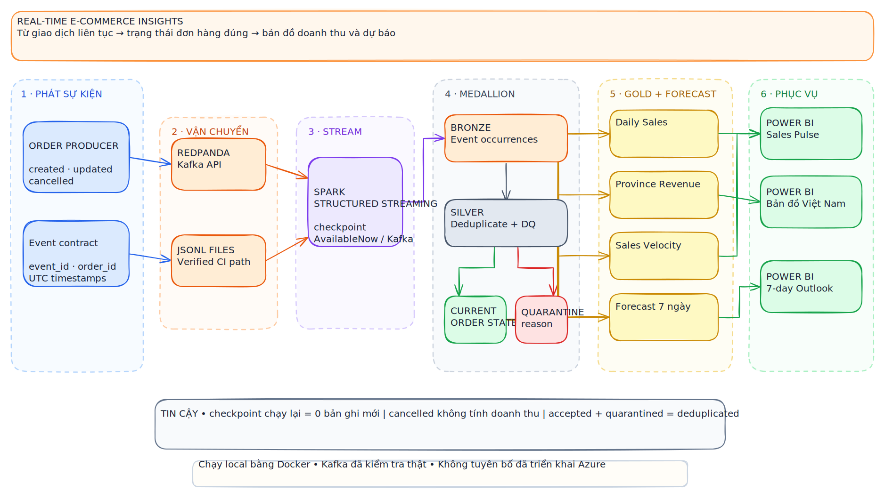

# Real-Time E-Commerce Insights & Sales Forecasting

[](https://github.com/npgb2505/realtime-ecommerce-insights/actions/workflows/ci.yml)
[](https://spark.apache.org/)
[](https://redpanda.com/)
[](LICENSE)

A local, cloud-ready streaming analytics platform for continuous e-commerce order
events. Redpanda provides the Kafka API, Spark Structured Streaming checkpoints
Bronze ingestion, PySpark curates Silver/Gold data, a transparent seven-day baseline
forecasts sales, and Power BI-ready exports support a Vietnam province revenue map.
No paid cloud account is required.

<p align="center">
  
</p>

<p align="center">
  <a href="docs/assets/architecture-realtime-commerce.excalidraw">Editable Excalidraw source</a>
</p>

## At a glance

| Events & transport | Trust & current state | Insights & forecast |
|---|---|---|
| ⚡ Created, updated, cancelled events | 🧹 Event-level deduplication + DQ | 📈 Daily sales and sales velocity |
| 🚌 Kafka/Redpanda integration path | 🧾 Latest event wins per order | 🗺️ Vietnam province revenue map |
| 🧪 Deterministic JSONL CI path | ⛔ Cancelled orders excluded from revenue | 🔭 Explainable seven-day forecast |

## Business problem

Regional sales teams cannot wait for a next-day batch to see demand shifts,
cancellations, or category velocity. The platform creates a replayable event backbone
and trustworthy current order state so analysts can monitor revenue by Vietnamese
province, compare hourly sales velocity, and review a short-horizon baseline forecast.

## What is implemented

- Deterministic order lifecycle producer with created, updated, and cancelled events.
- Kafka-compatible Redpanda broker, health check, and browser console.
- Actual Spark Structured Streaming file source with AvailableNow trigger and durable
  checkpoint; long-running Kafka source is included.
- Bronze event occurrences, Silver deduplicated events/quarantine/current state, and
  Gold daily, province, hourly velocity, and forecast products.
- Latest-event order-state resolution prevents updates/cancellations double-counting.
- Data-quality reconciliation, idempotent checkpoint rerun, pytest, Ruff, Docker, and CI.
- Power BI CSV exports, Vietnam coordinates, DAX, data contract, model, and runbook.

## Quick start: verified stream without a broker

```bash
docker compose build pipeline
docker compose run --rm pipeline demo --root /app/data
```

The deterministic demo generates 14 daily input files. Spark Structured Streaming
discovers them, commits a checkpoint, then publishes:

```text
data/lakehouse/bronze/order_events/
data/lakehouse/silver/order_events_clean/
data/lakehouse/silver/order_events_rejected/
data/lakehouse/silver/current_order_state/
data/lakehouse/gold/{daily_sales,province_sales,sales_velocity,sales_forecast}/
powerbi/exports/*.csv
artifacts/quality-report.json
```

Native execution requires Python 3.12 and Java 17. Docker is recommended on Windows
because PySpark does not bundle Hadoop's Windows-native local filesystem tools.

## Kafka path

```bash
docker compose up -d redpanda console
docker compose --profile kafka run --rm producer
```

Redpanda Console is available at `http://localhost:8081`. The Kafka topic is
`ecommerce.order_events`; the host bootstrap address is `localhost:19092`.

Run the long-lived Spark consumer with the connector on the classpath:

```bash
spark-submit \
  --packages org.apache.spark:spark-sql-kafka-0-10_2.13:4.0.0 \
  scripts/run_kafka_stream.py kafka \
  --root data --bootstrap localhost:19092 \
  --topic ecommerce.order_events
```

File streaming is the CI/reviewer path because it proves Structured Streaming
checkpoint semantics without a timing-sensitive external service. Kafka and file
sources feed the same event contract and medallion pipeline.

## Data flow and guarantees

```text
producer -> Kafka or partitioned JSONL
         -> Spark Structured Streaming + checkpoint
         -> Bronze event occurrences
         -> Silver unique events + rejected events
         -> latest event per order
         -> exclude cancelled current orders from sales
         -> Gold marts + seven-day forecast
         -> Power BI CSV products
```

Each source file is committed once by the file-source checkpoint. Kafka offsets are
checkpointed. The sink retains `event_id`, and Silver independently deduplicates by
latest `ingest_ts`; therefore a replay does not double-count the business state.
Rejected events are preserved rather than silently dropped.

## Data products

| Product | Grain | Purpose |
|---|---|---|
| `daily_sales` | date × province × category | revenue, orders, units, AOV |
| `province_sales` | province | Vietnam geographic demand map |
| `sales_velocity` | hour × province | near-real-time sales monitoring |
| `sales_forecast` | future date | seven-day trend/weekday baseline |

Dashboard import steps, coordinates, and DAX are in [powerbi/README.md](powerbi/README.md).

## Forecast design

The released baseline fits a linear trend to complete daily revenue and multiplies it
by observed weekday seasonality. It is deterministic, explainable, and tested to
produce exactly seven future dates. It is a portfolio analytics baseline—not a
production financial forecast. A production extension should compare it with
LightGBM/Prophet using rolling-origin validation and prediction intervals.

## Verification

```bash
pytest -q
ruff check .
docker compose config --quiet
```

Tests verify deterministic events, checkpointed no-op rerun, duplicate removal,
quarantine/reconciliation, current-state accounting, non-empty marts, positive
revenue, fixed forecast horizon, and generated dashboard inputs.

## Repository map

```text
realtime_commerce/      producer, stream landing, curation, forecast, CLI
docs/                   architecture, contract, model, operations
powerbi/                coordinates, dashboard specification, generated exports
tests/                  deterministic and end-to-end stream tests
.github/workflows/      quality and Compose verification
```

## Local-to-Azure mapping

| Local component | Azure deployment option |
|---|---|
| Redpanda/Kafka | Azure Event Hubs Kafka endpoint |
| filesystem Parquet | ADLS Gen2 + Delta Lake |
| local Spark | Azure Databricks |
| checkpoint directory | ADLS checkpoint location |
| CSV exports | Power BI dataset/dataflow |

This repository is Azure-ready architecture but does not claim a paid Azure deployment.

## Limitations

- The released forecast is a transparent baseline and has no uncertainty interval.
- Province coverage is a representative 12-province fixture, not all administrative units.
- File and Kafka sinks use open Parquet locally; production should add Delta Lake table
  transactions and catalog-managed atomic promotion.
- Generated events are synthetic and prove behavior, not production throughput.

## License

MIT. See [LICENSE](LICENSE).
