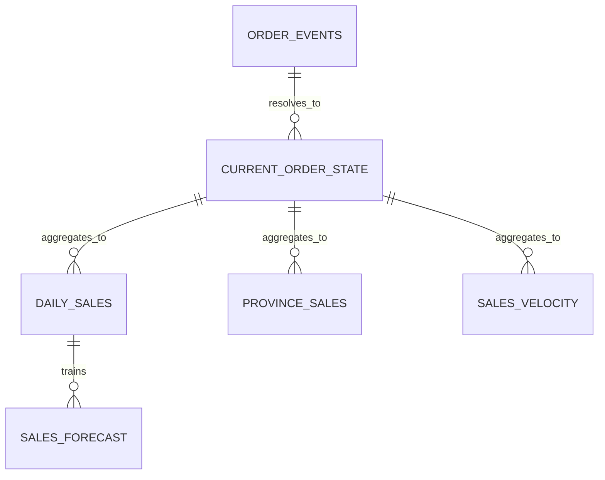

# Data model

Bronze grain is one event occurrence. Silver clean grain is one unique event ID;
current order state is one latest lifecycle event per order. Gold grains are
date/province/category, province, hour/province, and forecast date.
